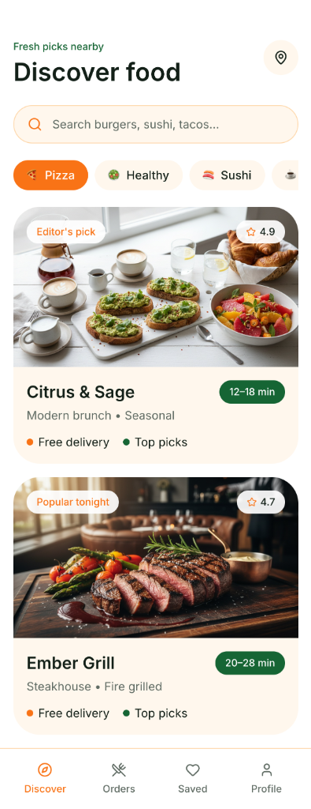
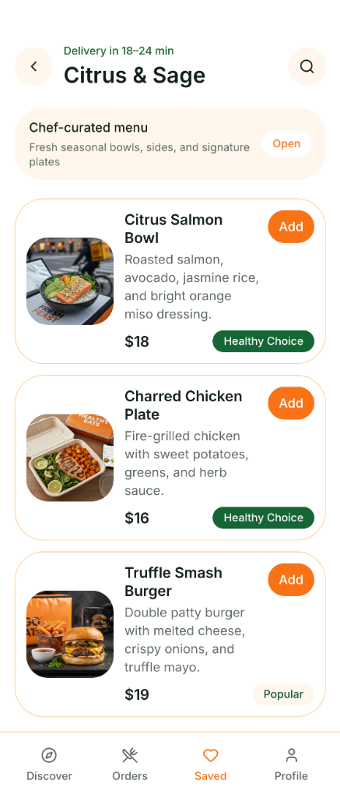
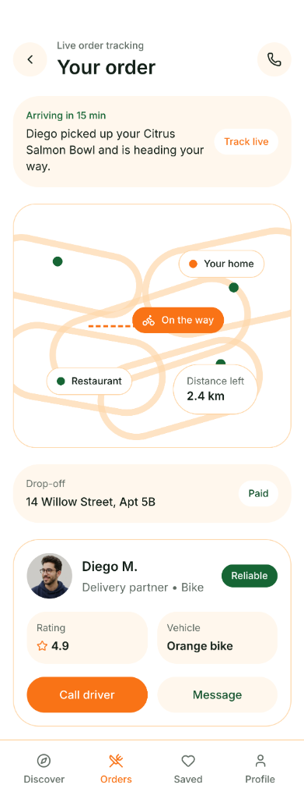

# 📦 Express Delivery

**Fresh. Fast. Energetic.**

Express Delivery is a high-fidelity logistics and food delivery application built with Flutter. It features real-time order tracking, a modern restaurant discovery interface, and a professional blue-themed corporate identity optimized for speed and reliability.

## 📸 Screenshots

  
  
  

## ✨ Features

- 📍 **Live Tracking** — Interactive map interface with real-time driver location and arrival estimates.
- 🍔 **Restaurant Discovery** — Editorial-style discovery feed with "Editor's picks" and "Popular tonight" tags.
- 📜 **Chef-curated Menus** — Polished menu layouts with high-resolution food photography and easy "Add" actions.
- 🚲 **Driver Integration** — Full driver profile view including ratings, vehicle info, and quick communication buttons.
- 💳 **Seamless Payments** — Transparent fare breakdowns and integrated payment status tracking.

## 🛠️ Tech Stack

- **Framework**: Flutter
- **State Management**: Riverpod
- **Icons**: Lucide Icons
- **Design System**: Professional Logistics UI
